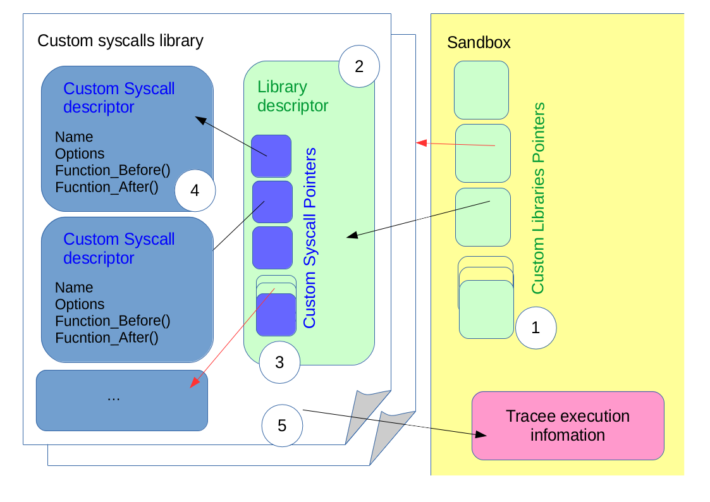
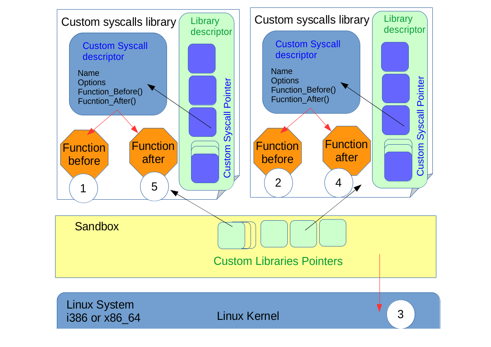

Custom Syscalls and Custom Libraries
====================================

In order to provide Sandbox with a function to execute instead/after/before the kernel syscall, custom dynamic libraries are loaded by Sandbox, each containing 1 function implementation of the syscall and the required structures describing the library and the custom syscalls. The custom functions must be written with the same signature as the real syscall, but the function itself is recommended to have a different name.

> For a given syscall, if more than 1 custom function is to be executed instead, then several dynamic libraries would need to be passed to the SandBox, each library containing 1 of the custom functions.

The coordination between Sandbox and the custom libraries is shown in the picture below. The custom libraries must make use of the structures defined in **sandbox_customSyscall_descriptor.h**. There is a *custom_library_descriptor* in each custom library, and Sandbox keeps a list of them as they are loaded from the command line. This library descriptor points internally to an array of *custom_syscall_descriptor*, also inside the library. There must be a **custom_library_descriptor** for each custom syscall function implemented in the library, where the *INDEX* in the array is the *SYSCALL NUMBER* (i.e., in architecture **i386**, if the custom function replaces the **read()** syscall, then the *INDEX* in the array is **3**, as 3 is the corresponding *SYSCALL NUMBER* for **read()**). Additionally, the library has access to information about the **tracee** execution process through a structure **tracee_descriptor** available in the Sandbox, so that the custom function can follow the behavior of the it.

> Any error while loading the custom syscalls or while checking the structures consistency will prevent Sandbox from executing the **tracee** process.



# Custom Syscall

In the library file, for each custom syscall there must be an structure **custom_syscall_descriptor**.
This structure has the definitions needed by Sandbox to operate. There is a function pointer to a function *BEFORE* the KERNEL and another pointer to a function *AFTER* the KERNEL. If any of those is not implemented, keep the function pointer to **NULL** value.

> At least one of the function pointers must be valid.

The normal execution order is as follows:

 1. First, just after the syscall call from the **tracee**, the function pointed by **custom_syscall_before()** is called. Its return value is kept to be passed to the **tracee**. If this pointer is *NULL*, this step is ignored.

 1. Then, the normal kernel syscall is executed. The return value is overriden by the custom syscall return value.

 1. Finally, just before returning to the **tracee** after the normal kernel syscall, the function pointed by **custom_syscall_after()** is called. Its return value is kept to be passed to the **tracee**. If this pointer is *NULL*, this step is ignored.

The available FLAGs to set in this syscall descriptor are used when multiple libraries implement the same syscall. See below.

> Check **sandbox_customSyscall_descriptor.h**  for details.

Example of a Custom Syscall in a Custom Library:

```
custom_syscall_descriptor custom_syscall = {
		NULL,
		(long int (*)())myread,
		"myread",
		FLAG_KEEP_PREVIOUS_RETURN
		};
```

# Custom Library

Several custom syscalls can be packed in the dynamic library file (lib*.so).
The naming convention must be `^lib[A-Z|a-z|0-9]*.so$`.

In the library file, a structure **custom_library_descriptor** must exist and be called like the macro **CUSTOM_LIBRARY_DESCRIPTOR_SYMBOL** in **sandbox_customsyscall_descriptor.h**.

In the library itself, there will be an array of **custom_syscall_descriptors**, where the *INDEX* of the array is the *SYSCALL NUMBER*.

The array will have as many elements as the highest *SYSCALL NUMBER* being implemented in the library. The array elements corresponding to *SYSCALL NUMBERS* not implemented must be left in *NULL* (0).

> Please be aware that the numbers change according to the running system's architecuture. Check **syscall_table_i386.txt** and **syscall_table_X86_64.txt**  for details.

The descriptor **custom_library_descriptor** has 2 function pointers that are called when the library is just loaded and before leaving the Sandbox. This allows to have some initialization and closing routines for the custom library. Lease these pointers to *NULL* if the functions are not implemented.

In the library file, a structure pointer **tracee_descriptor** must exist and be called like the macro **CUSTOM_TRACEE_DESCRIPTOR_SYMBOL** in **sandbox_customSyscall_descriptor.h**.

The information available refers to the **tracee** PID value, syscall execution return values and state.

Please check  **sandbox_customsyscall_descriptor.h**  for details.

Example of a Custom Library:

```
#include "sandbox_**customSyscall**_descriptor.h"

tracee_descriptor* CUSTOM_TRACEE_DESCRIPTOR = NULL;

custom_library_descriptor CUSTOM_LIBRARY_DESCRIPTOR = {
	custom_syscalls_array_1, WRITE_SYSCALL_NUMBER+1,init,end,"libIO"
	};

custom_syscall_descriptor custom_syscalls_array_1[] = {
	[SYSCALL_NUMBER] = {
						NULL,
						NULL,
						"mysyscall",
						0
					}
};
```

# Multiple Libraries and Sequential execution

Several custom syscalls functions can be called for the same syscall, provided that they are implemented in different libraries. Therefore, there could be 2 custom syscalls for the **read()** operation, and both will be called, according to the options provided in the descriptors.

The order in which the custom syscalls are called is dictated by the order of appearance of the custom libraries in the *-l* options.

 * Just before the kernel tries to execute a syscall, the custom libraries are checked from first to last. If the library implements the syscall, the *BEFORE* function is executed.
The return value is initializated to **DEFAULT_RETURN_VALUE** and then each function overrides the return value as they are executed one after the other; unless **FLAG_KEEP_PREVIOUS_RETURN** is specified.

 * Once all libraries have been checked, the normal kernel syscall is executed.
If any of the custom syscalls specified the flag **FLAG_DONT_CALL_KERNEL**, the kernel default syscall is not called.

 * Just after the kernel has executed the normal syscall and before returning to the **tracee**, the custom libraries are checked from last to first. If the library implements the syscall, the *AFTER* function is executed.
Each function overrides the return value, unless **FLAG_KEEP_PREVIOUS_RETURN** is specified.

> This means, direct order before the kernel, inverse order after the kernel.

If any of the custom syscall in the chain returns a negative value, and the flag **FLAG_QUIT_IF_RETURN_NEGATIVE** was specified, the execution of the syscall chain process is aborted for this and all next custom syscalls.
Then the kernel syscall is directly called or the syscall processing is returned to the **tracee**.



Use the execution option `-t` to have Sandbox show the execution path for a given set of libraries

```
 sandbox  -t [ -L <path> [-L <Path> ... ]] [ -l <library> [ -l <library> ... ]]
```

# Developing Custom Syscalls

When developing a custom syscall for Sandbox, please follow these steps:

 1. Create a `.c` file with your custom syscall, respecting the same signature and types as the original syscall.

 1. Include **sandbox_customsyscall_descriptor.h**.

 1. Create a **custom_syscall_descriptor** for each custom syscall in your file. Put them in the array of descriptors, where the *INDEX* in the array is the *SYSCALL NUMBER*.

 1. Create a **custom_library_descriptor** called **CUSTOM_LIBRARY_DESCRIPTOR**. Use this name as Sandbox will look for this when loading the library.

 1. Create a **tracee_descriptor** pointer called **CUSTOM_TRACEE_DESCRIPTOR**. Use this name as Sandbox will look for this when loading the library.

 1. Compile your custom library as instructed in the documentation.

Example:

```
// Array of Structures, one per custom syscall
	custom_syscall_descriptor my_array[] = {
	[20] = {NULL, (long int (*)())mygetpid, "getpid" ,0},
	[64] = {(long int (*)())mykill,0,"kill",FLAG_DONT_CALL_KERNEL},
	[110] = {NULL,(long int (*)())mygetppid,"getppid",0}
};

// Library Descriptor
custom_library_descriptor CUSTOM_LIBRARY_DESCRIPTOR_SYMBOL = {
	my_array, 111 ,"libpid"
	};

// Tracee Descriptor
tracee_descriptor* CUSTOM_TRACEE_DESCRIPTOR = NULL;
```

# Acess to **tracee** execution values and memory

> The **tracee** and the Sandbox execute on different memory spaces and are subject to the kernel's memory access control.

The information values that the library (any custom syscall in the library) can have access to are described in **tracee_descriptor**. Among these, there is the **PID number**. With the **PID number**, the helper function **read_memory_byte()** allows the custom syscall to copy to its buffer some memory chunk from the **tracee**.

In order to use **read_memory_byte()**, use the helper file **libSandboxHelper.c** and compile your library as follows:

```
gcc -c  -fPIC   libXYZ.c
gcc -c  -fPIC   libSandboxHelper.c
gcc -shared  -nostdlib  -o libXYZ.so libXYZ.o  libSandboxHelper.o  
```

Similarly, there is **write_memory_byte()** that allows the custom syscall to copy from its buffer to some memory chunk in the **tracee**.
