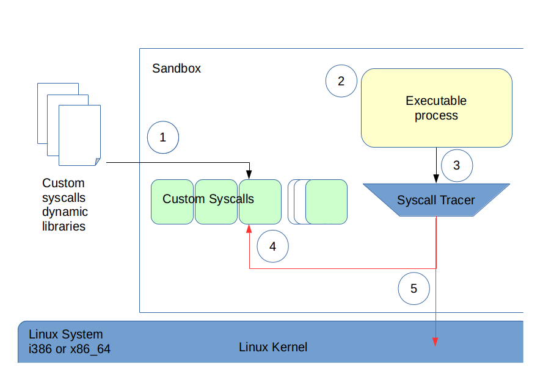

Linux Syscall SandBox Tool		
============

> Sandbox - Télécom Sudparis - MSc CCN 2016.
>
> Ignacio TAMAYO and Vassanthaphriya VIJAYAN
>
> Jun 6th 2016
>
> 1.4

## Introduction

This program was developed as a course project for class CSC7201, under supervision of Professor Eric Renault (eric.renault@telecom-sudparis.eu).
Many thanks for this guidance and assistance throughout the development.

This program is based on *ptrace* and *ld* C libraries.

The Sandbox tool will monitor a **tracee** executable, capturing its syscalls calls, and executing custom routines instead, which are found in dynamic libraries.

The Sandbox works entirely on user-space, which has the downside of slow speed, but is very flexible for running custom code instead of the syscalls without touching the kernel.

When calling Sandbox, several custom dynamic libraries can be loaded, containing the methods to call before/instead/after of the kernel syscall and additional options. Refer to ****customSyscall**s.md** for details about the posibilities.

While executing the **tracee**, if the syscall captured is implemented in any of the custom libraries loaded by Sandbox, that function is executed with the options/conditions described in the library. Otherwise, if the syscall captured is not implemented in any of the custom libraries, the normal kernel syscall function is called and executed. Several custom functions can be executed for the same syscall, giving space for extensibility.

When the **tracee** terminates (or is terminated by signals), the Sandbox also terminates.

In *VERBOSE* mode, several lines of output will help visualize the tracing of the syscalls and its execution.

The Sandbox keeps track of all the processes that are forked or clone by the **tracee**, allowing to capture the syscalls of the child processed.

> Works on i386 and x86_64 architectures

# Definitions

 * **Linux Syscall Sandbox tool** :
The program that monitors a **tracee** executable and intercepts its syscalls. The Sandbox can call the normal kernel syscalls or any **customSyscall** provided in the dynamic libraries passed as options in the command invocation.

 *  **tracee executable** :
The program that is executed in the Sandbox, and that is monitored for syscalls.
The Sandbox terminates when the **tracee** terminates, either normally or by signals.

 * **tracee executable child** :
The child process created by the **tracee**, that is also monitored by the Sandbox.

 * **Custom syscalls** :
A particular function to be executed before/instead/after of the corresponding kernel syscall. This function must have the same signature as the syscall, but a different name is recommended. It must be included in one of the dynamic libraries passed as parameter to the Sandbox. Several functions can be executed sequentially for a captured syscall, and Sandbox supports some options to modify the execution behavior.

 * **Custom dynamic library** :
A library that contains one or more **customSyscalls** for the Sandbox to use. Must be compiled as a *SHARED* library (lib*.so).

# Usage

This program is intended to be executed in console, to monitor the **tracee** with a set of libraries use:

	sandbox [-v] [-p] [-L <path> [-L <Path>...]] [-l <library> [-l <library> ...]] <tracee>

	 -v	Verbose mode to STDOUT
	 -p Trace also the child processes of the tracee, created by fork() or threads.
	 -l <library>	Name of the library, in the gcc format. If library is libXYZ.so, put "-l XYZ"
	 -L <path>		Path to look for the custom libraries. Must come before the corresponding -l option
	 <tracee>		Executable to be traced by Sandbox. Must not have redirection mechanisms ( |, <, >, >>)

Sandbox supports the use of multiple libraries and chained syscall execution for the same syscall interruption. To print the execution path for a set of libraries use:

	sandbox -t [-L <path> [-L <Path> ... ]] [-l <library> [-l <library> ... ]]

	 -t		Shows the execution tree for the given custom libraries
	 -l		As above
	 -L		As above

To have the instructions printed, use:

	sandbox	-h

EXAMPLE:

	sandbox -v -L ./libs -l sqrt equation

### Notes :

 * The order of the *-L* options is sequential. Each path indicated by *-L* is added to the paths list as the options are analyzed.  
 * Make sure you provide the *-L* path to the library before the *-l* library name, otherwise the path will not be on the list when looking for the library.
 * If a library is found on 2 or the library paths, the library found in the first path passed in *-L* is used.
 * Because of the shell interpreter, the **tracee** process call cannot have redirections or any bash manipulation (`| < > >> && ||`). Instead, execute **sandbox** in both sides of the redirection.
Example:
	`sandbox [options] <cmd_1> | sandbox [options]  <cmd_2>`

## Program design and structure

In order to fully utilize the language features of C, this program is designed in Structural programming, where each main function is organized sequentially and data flows from one functional process to the next.
Each process is later specialized in functions, taking care not to overlap functions and ensure a fluent flow of information.

The Sandbox program is composed of the following modules, implemented each in a set of **.c/.h** files

 * Main executable file ( sandbox.c )

 * Unified output and error Messages (  messages.h   )

 * Processing the command line options (  opts.c,  opts.h  )

 * Loading the dynamic libraries and the custom syscalls ( dynlib.c, dynlib.h)

 * Performing monitoring and syscall capture (trace.c, trace.h)

 * Template for custom syscalls, compulsory to implement (sandbox_customsyscall_descriptor.h)

Please refer to the design diagrams for details on the interaction of the modules.

# Compilation

This code has been written and tested for architectures **i386** and **x86_64**.

To compile the libraries:

	gcc -shared -nostdlib  -o {.so file} {.o file}

To compile the sources for the sandbox:

	gcc -c -fPIC -o {.o file} {.c file}
	gcc -ldl -o sandbox {.o files}

# Tools and References

This project is documented with DoxyGen, https://www.stack.nl/~dimitri/doxygen/manual/commands.html.

Automated-compilation with MakeFile.

The map of the syscalls for the different architectures was taken reference from:

https://www.cs.utexas.edu/~bismith/test/syscalls/syscalls64_orig.html,
http://docs.cs.up.ac.za/programming/asm/derick_tut/syscalls.html,
http://blog.rchapman.org/post/36801038863/linux-system-call-table-for-x86-64

The description of passing parameters to functions in the architectures was found here:
https://en.wikipedia.org/wiki/X86_calling_conventions#x86-64_calling_conventions
